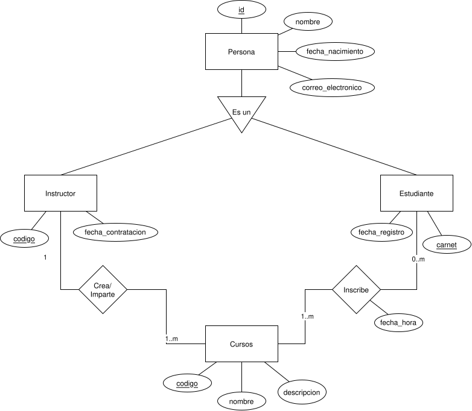
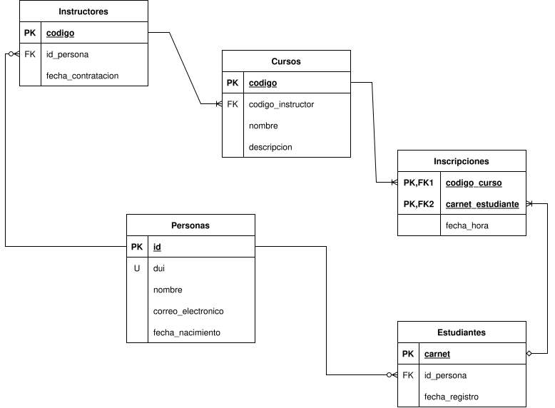

# API para una Plataforma de Cursos Online

Un instructor puede crear cursos. Un estudiante puede inscribirse en múltiples cursos.

La API debe gestionar la relación de inscripciones y permitir listar los cursos de un estudiante o los estudiantes de un curso

## Diagramas:

### Entidad-Relacion

### ER

### Casos de Uso
